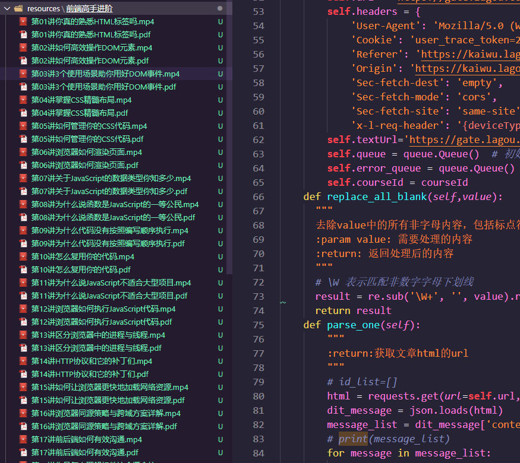
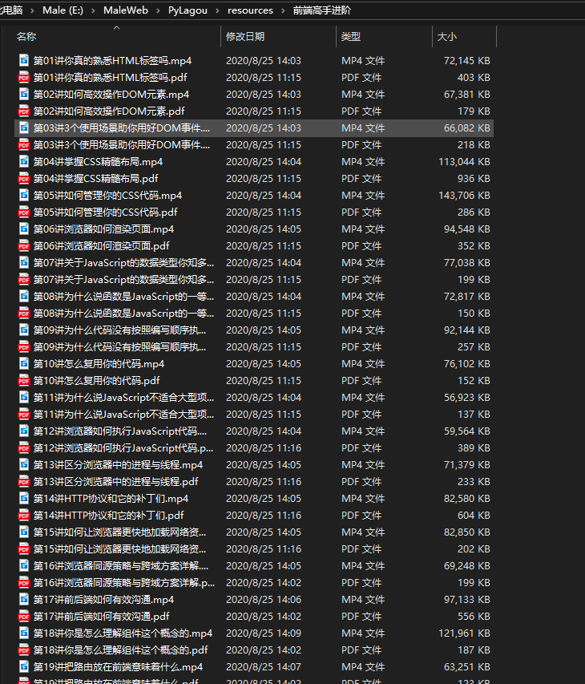

<p align="center">
  <a href="#">
    
  </a>
</p>

<h1 align="center">PyLagou</h1>
---

<div align="center">
此仓库已过期，新的key已升级加密算法，不过代码逻辑可以参考
<del>💥1元羊毛党不长久，下载下来才是学习之道；刚学python不久，上手一个项目玩玩，爬取拉勾教育的公开课，连同视频和文章PDF一块保存到本地；<del>

<a href="/LICENSE"></a>
<a href="https://travis-ci.org/alibaba/ice"></a>
<a href="https://codecov.io/gh/alibaba/ice"></a>
<a href="https://github.com/alibaba/ice/pulls"></a>

<div align="center">
  
</div>
<div align="center">
  
</div>
<div align="center">
  
</div>
</div>

## Features

- :fire:**导出pdf**：由于图片含有防爬密钥，转成PDF阅读体验更佳
- :100:**解析TS文件，压制成mp4**：遍历文章id，获取m3u8地址，解析每个ts的key解密，按顺序排列，压制成mp4文件(如果有ffmpeg压制方案可以追加，ffmpeg可以指定视频为h264编码格式，可用于OSS存储web端播放).目前是本地写了批量转码脚本；
- :tophat:**断点/封号**：访问请求频发，大概率会触发封号机制，或者中断传输；最好增加time.sleep(5),心急吃不了热豆腐；
- 🐦 **待添加**：多进程同步执行  
- 🦊 **待添加**：导入本地mysql数据库 


## Precondition
- [安装Python 3.8.5](https://www.python.org/downloads/release/python-385/)
- pip阿里云镜像
    用户目录下创建pip文件夹，新增pip.ini文件，输入内容：
```bash
[global] 
index-url = http://mirrors.aliyun.com/pypi/simple/ 
[install] 
trusted-host=mirrors.aliyun.com 
```
- [安装wkhtmltox包](./assets/wkhtmltox.zip),解压以后记录路径替换pdf.py里面的`path_wk`变量
- 在PC端登录你的拉勾账号，找到公开课或者已购课程，通过chrome的F12找到cookie，替换`run.py`和`pdf.py`中的cookie部分


## Quick start
安装依赖，填写`gl.py`内的cookie信息

```bash
 $ pip install  requirements.txt
```

Run code 

```bash
 $ python run.py
```
输入课程ID

## Learning Materials
- [N_m3u8DL-CLI](https://github.com/nilaoda/N_m3u8DL-CLI)
- [DownLoad-m3u8](https://blog.csdn.net/nudt_spy/article/details/104487430/)
- [解密ts文件](https://blog.csdn.net/a33445621/article/details/80377424)

## Tips
- 只有试听或者已购买的可以下载，其他请求失败，跳出进程；
- oss仅支持pdf上传
- 仅供学习研究，禁止商业化行为
## License

[MIT](/LICENSE)
